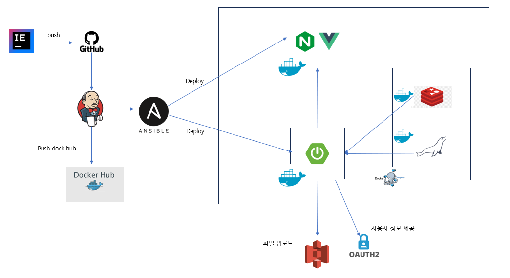
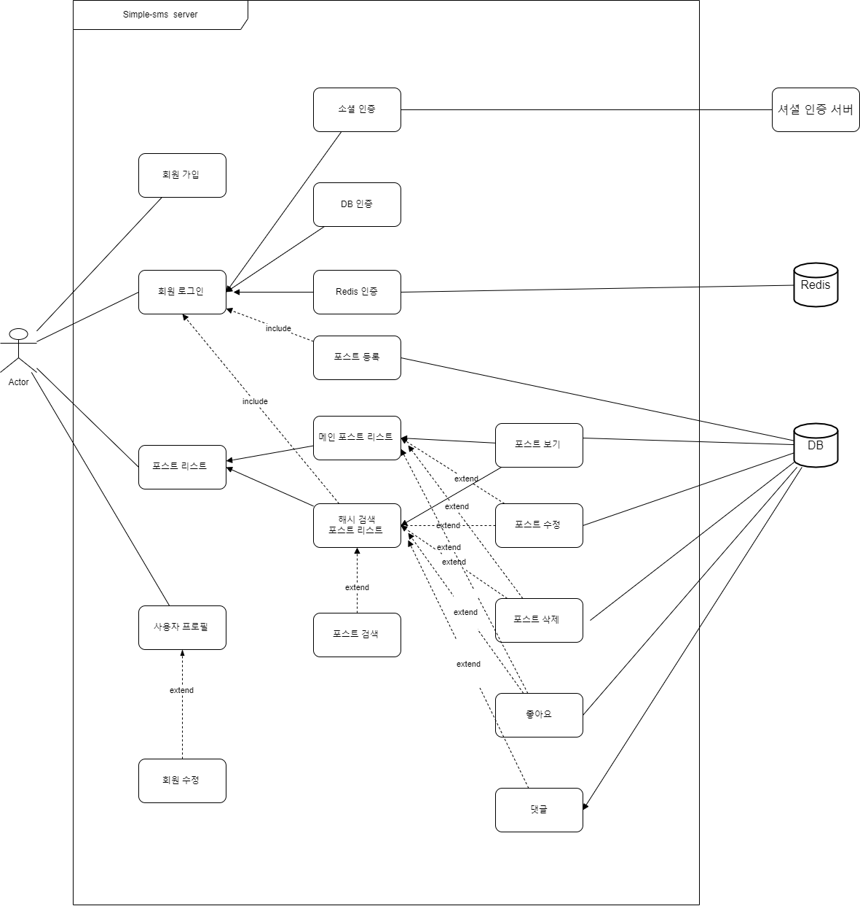
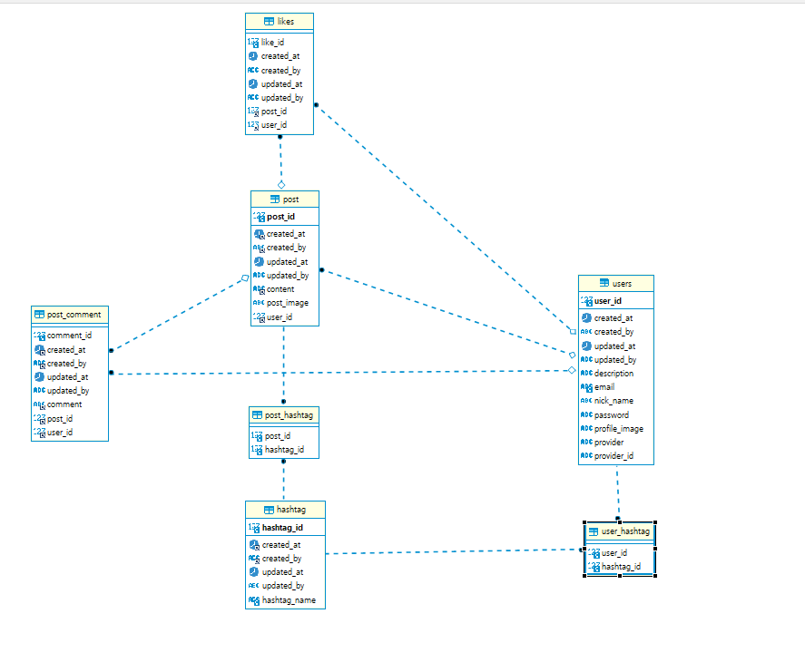
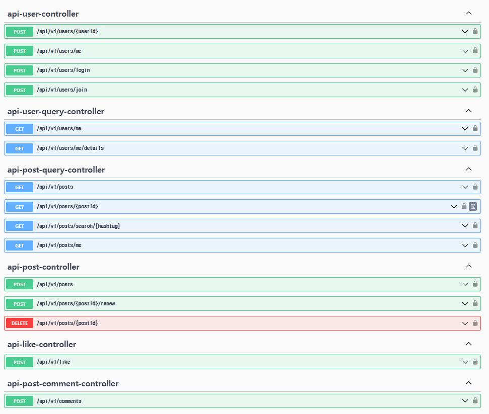

## 프로젝트 개요

간단한 Post 등록/수정/삭제, 댓글, 좋아요, SNS 간단 로그인 기능이 있는 간단한 SNS Backend 프로젝트

## FrontEnd Githut 주소

[https://github.com/hanseungyeoun/simple-sms-front-end](https://github.com/hanseungyeoun/simple-sms-front-end)

## 개발 언어및 활용기술

Backend

        

**Deploy**

    
`

### **설계 및 문서**

---

### 시스템 구조



### 유즈케이스 다이어그램



### **ERD**



### API



### **프로젝트 실행 방법**

1. Kakao, Naver, Google OAuth 인증 키 발급을 받아야 합니다.
2. S3 버킷 생성 후 S3 full access 권한을 가진 사용자 생성후 인증키를 발급 받습니다.
3. .env 파일 생성하여서 프로젝트내 필요한 환경 변수를 지정해야 합니다.

   환경 변수 목록

   | environment                      | description                      |
               | -------------------------------- | -------------------------------- |
   | SPRING_PROFILES_ACTIVE           | profile 값 “prod” 지정           |
   | SPRING_DATASOURCE_USERNAME       | db 접속 계정                     |
   | SPRING_DATASOURCE_PASSWORD       | db 비밀 번호                     |
   | GOOGLE_CLIENT_ID                 | Google Oauth Client Id           |
   | GOOGLE_CLIENT_SECRET             | Google Oauth Secret Id           |
   | KAKAO_CLIENT_ID                  | Google Oauth Client Id           |
   | KAKAO_CLIENT_SECRET              | Google Oauth Secret Id           |
   | NAVER_CLIENT_ID                  | Google Oauth Client Id           |
   | NAVER_CLIENT_SECRET              | Google Oauth Secret Id           |
   | AWS_S3_ACCESS_KEY                | AWS에 접근하기 위한 ACCESS_KEY   |
   | AWS_S3_SECRET_KEY                | AWS에 접근하기 위한 SECRET_KEY   |
   | AWS_S3_BUCKET                    | S3 버킷명                        |
   | AWS_S3_DIR                       | S3 버킷 폴더명                   |
   | AWS_S3_REGION                    | S3 Region                        |
   | JWT_ACCESS_TOKEN_SECRET          | JWT Token                        |
   | JWT_ACCESS_TOKEN_EXPIRATION_MSEC | JWT 만료 시간 MS                 |
   | DOWNLOAD_PATH                    | 로컬 테스트용 다운로드 폴더 경로 |

4. 프로젝트 빌드

   ```java
   ./gradlew clean build -x text
   ```

5. Docker 컴포즈를 이용 하여 실행 하기

   ```java
   docker-compose -f .\docker-compose.yml  up
   ```
